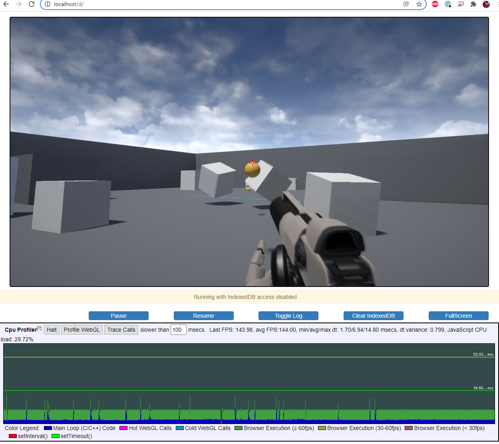

# UE-HTML5

HTML5 platform support for Unreal Engine development tracker.

Check [UE-HTML5 Project](https://github.com/users/ufna/projects/1/) for current development taskboard.

### Branches to mention

* **[4.24-html5](https://github.com/ufna/UnrealEngine/tree/4.24-html5)** - UE 4.24.3 vanilla release with HTML5 platform updated to **emscripten 3.0.0**
* **[4.24-html5_epic](https://github.com/ufna/UnrealEngine/tree/4.24-html5_epic)** - _deprecated_ branch based on [original Epic's development](https://github.com/UnrealEngineHTML5/)

### Core ideas

* No multithreading. It's basically dead idea for the modern web, so no support will be provided until its ressurection.
* Keep emscripten updated.
* Vanilla UE branches, all necessary engine code changes applied as runtime patch on setup stage.
* Two parallel dev directions: 
  * Platform improvements: downloaded packages caching, multiple pak files, built-in DLC support, and other stuff to make it lightweight and rapidly launch.
  * Engine update: move to UE 4.27 first with WebGL2/OpenGLES3.1 support, then WebGPU research is planned.
* UE5 support is not considered for now as it has lack of 32-bit support, and emscripten [hasn't 64-bit](https://github.com/emscripten-core/emscripten/issues/12087). Once UE5 will be released I'll check is it possible to create a some kind of frankenstein to mix them.

Also, I call this "tool" as a plugin. Basically it's not exactly a plugin, but it suits me.

### How to use

Clone the desired branch. Go to `Engine/Platforms/HTML5` and launch `HTML5Setup.sh` with **Git Bash**. Then work with UE as usual.

